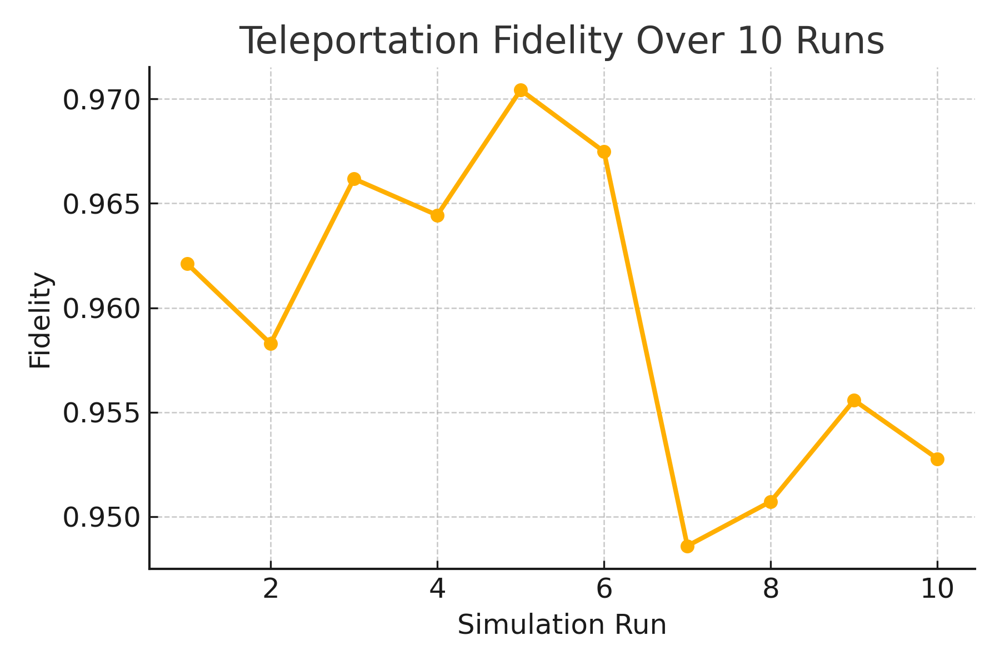

# 🧠🔒 QNHT Framework for 6G Quantum Neural Synchronization

This repository implements the core algorithms and simulation tools from the paper:

**"Synchronization and Control of Entangled Quantum Neural Networks for Holographic Communication in 6G Distributed Systems"**

---

## 📁 Contents

- `algorithms/`: Core Python implementations
  - `QNS.py`: Quantum Neural Synchronization (GHZ-based)
  - `HTP.py`: Bell-State Quantum Teleportation
  - `JOL.py`: Joint Optimization Loop (QNS + HTP + RIS)
- `main_simulation.ipynb`: Jupyter Notebook demo (run this first)
- `results/`: Output figures
  - `fidelity_over_runs.png`: Fidelity over multiple teleportation runs

---

## ▶️ Usage

To run the main experiment:

```bash
pip install qiskit matplotlib
jupyter notebook main_simulation.ipynb
```

---

## 📊 Sample Output



---

## 🔬 Paper Citation (IEEE TNSE)

> Al-Karawi, Y., et al. “Synchronization and Control of Entangled Quantum Neural Networks for Holographic Communication in 6G Distributed Systems,” IEEE Transactions on Network Science and Engineering, 2025.

---

## 📘 License

This repository is for academic research and educational use. All rights reserved.

